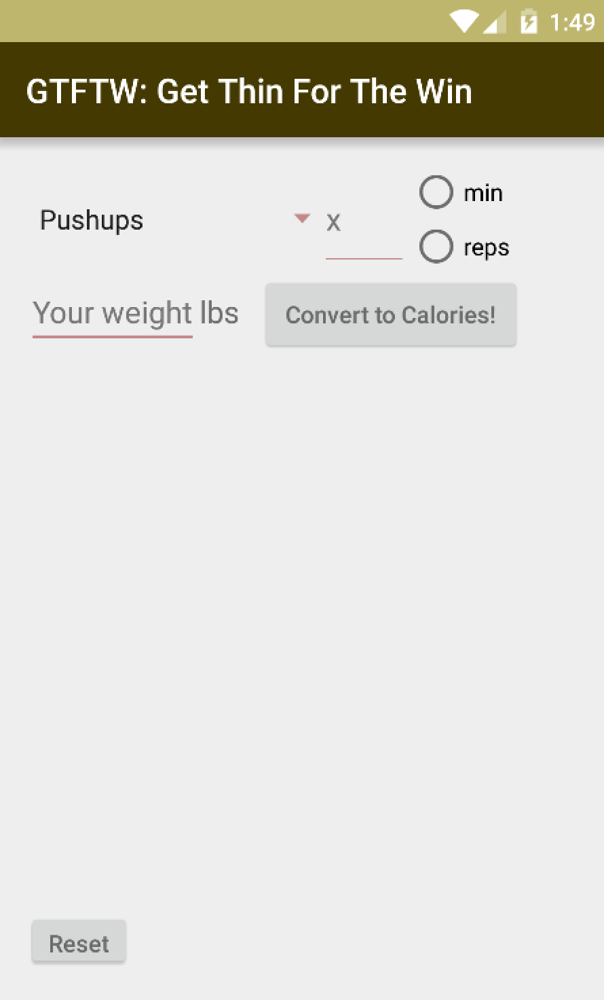

# PROG 01: GTFTW

'Get Thin For The Win' is a basic Android application which allows the user to check how many Calories they are burning in regards to one's body weight and the relevant excerise. The coolest feature is the contiguously featured stats which state the amount of reps/minutes for equivalent caloric throughput so that the user can change up their routine and continue to burn Calories at the same rate.

## Authors

*Ryan Kapur* ([eecsmasterrace@berkeley.edu](mailto:eecsmasterrace@berkeley.eduu))

## Demo Video

See [GTFTW] (https://youtu.be/PrFOkoB4CaI)

## Screenshots

## Acknowledgments

http://stackoverflow.com/questions/2808535/round-a-double-to-2-decimal-places
http://www.mkyong.com/android/android-radio-buttons-example/
http://www.sparkpeople.com/resource/calories_burned_list.asp
http://stackoverflow.com/questions/15564614/how-to-restart-an-android-application-programmatically

